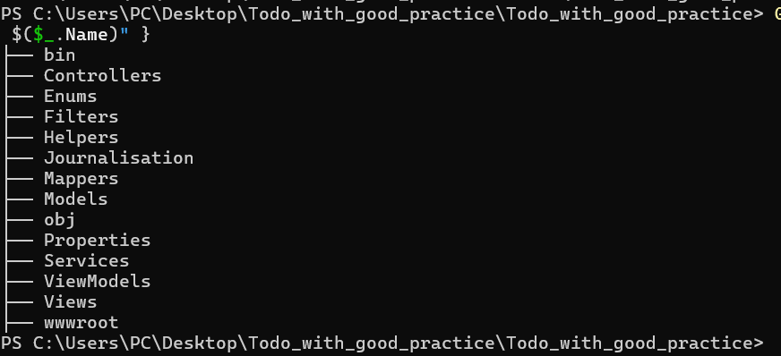

# Todo With Good Practices – ASP.NET Core MVC


A simple but well-structured **Todo web application** built with **ASP.NET Core MVC** to demonstrate **clean architecture**, **SOLID principles** (especially **S** and **D**), dependency injection, filters, ViewModels, mappers, and custom logging.

Perfect for learning good development practices without the complexity of a database.

##  Main Features

###  Authentication (Session-Based)
- Login & Register forms
- Hardcoded users (no database – intentional for simplicity)
- Logged user stored in `Session` as `SessionUser`
- Logout clears the session

### 📝 Todo Management
- Create, Read, Update, Delete (CRUD) Todos
- Todos stored in `Session`
- Managed via dedicated `SessionTodoService`

### 🧩 Custom Filters
- `SessionAuthAttribute` – protects Todo pages (redirects to login if not authenticated)
- `AuthLoggingFilter` – logs authentication actions (start/end, username, timestamp)

### 📄 Custom Logging System
- File-based logger (`FileLogger`)
- Logs all important actions:
  - Login/Register attempts
  - Logout
  - Controller action start/end
- Logs saved in `/Journalisation/` folder as text files

###  Architecture & Good Practices
This project strictly follows:

####  **S** – Single Responsibility Principle
Each class has **one clear responsibility**:
- `Controllers` → handle HTTP requests only  
 `ViewModels` → shape data for views  
 `Mappers` → convert between models and viewmodels  
 `Services` → business/session logic  
 `Filters` → authentication & logging  
 `Helpers` → file logging  
 `Models` → pure data entities  

No "God classes" – everything is separated!

####  **D** – Dependency Inversion Principle
- All services use **interfaces** (`ISessionService`, `ITodoService`, etc.)
- Dependencies injected via constructor
- Controllers and filters depend on **abstractions**, not concrete classes

## 📁 Project Structure

##  How to Run

```bash
git clone https://github.com/Faresbrahiim/TODO_tp.git
cd TODO_tp
dotnet restore
dotnet run

Open your browser and go to:
 http://localhost:5000
Default login (hardcoded):

Username: admin
Password: password
